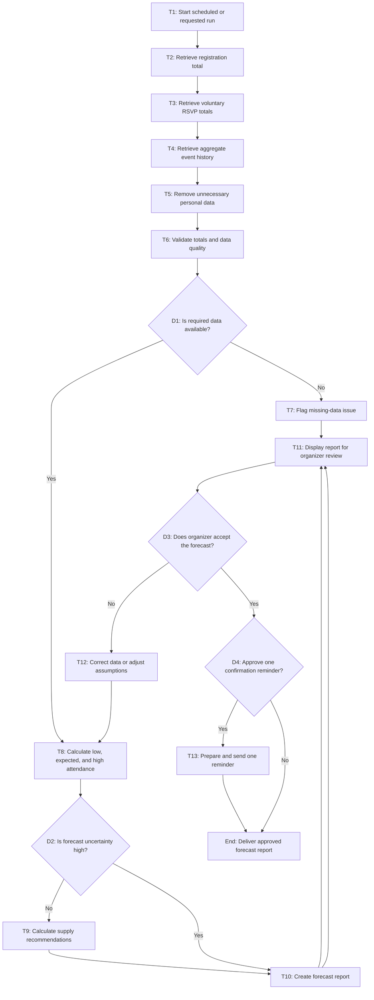

# Workflow of Tasks

*Replace all bracketed prompts with information specific to your proposed system. Delete instructional text that does not belong in your final specification. Add or remove task sections as needed. Every task shown in the general workflow must have a corresponding task specification below.*

## 1. Workflow Overview
### 1.1 Workflow Goal
This workflow supports the system goal defined in `my_first_agent/README.md`.

### 1.2 Workflow Trigger

The workflow starts automatically at 9:00 AM each day during the two weeks before the CPVC AI Hackathon. It also starts when registration closes and when organizers manually request an updated forecast after a major change, such as a venue-capacity change, a change in the food budget, or a large increase in registrations.

### 1.3 Completion Condition at Runtime

One workflow run is complete when HackTrack has validated the available aggregate event data, calculated low, expected, and high attendance estimates, converted the expected estimate into recommended quantities of food, drinks, and swag, identified any data-quality or uncertainty concerns, and delivered a forecast report for organizer review. If a reminder is needed, the run is complete after the system prepares the reminder for organizer approval; it does not send the reminder automatically.

### 1.4 General Workflow

HackTrack starts by collecting the current total number of registrations, voluntary RSVP totals, and aggregate attendance results from previous CPVC events. The system removes unnecessary personal information and checks the data for missing values, duplicate totals, or inconsistent registration and RSVP counts. If required data is missing or unreliable, HackTrack flags the issue and sends the report to organizers for review instead of creating a new attendance estimate.

When sufficient data is available, HackTrack calculates low, expected, and high attendance estimates using the current registration total, voluntary RSVP responses, and historical CPVC attendance patterns. The system then checks whether the gap between the low and high estimates is too large. If uncertainty is low, HackTrack calculates recommended quantities of food, drinks, and swag, creates a forecast report, and displays it to organizers. If uncertainty is high, HackTrack creates a report that clearly flags the uncertainty and sends it to organizers for review without automatically creating supply recommendations.

Organizers review the forecast report. If they do not accept it, they can correct the data or adjust planning assumptions, and HackTrack returns to the attendance-calculation step to create an updated forecast. If organizers accept the forecast, they may approve one confirmation reminder for registered students. HackTrack prepares and sends the reminder only after approval. The workflow ends when the approved forecast report is delivered to organizers, with any approved reminder completed.

### 1.5 Workflow Diagram

