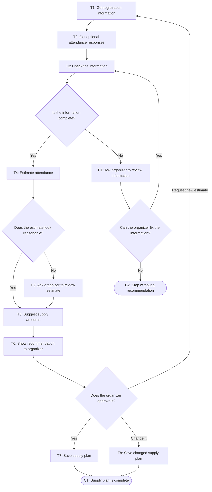

# Workflow of Tasks

*Replace all bracketed prompts with information specific to your proposed system. Delete instructional text that does not belong in your final specification. Add or remove task sections as needed. Every task shown in the general workflow must have a corresponding task specification below.*

## 1. Workflow Overview
### 1.1 Workflow Goal
This workflow supports the system goal defined in `my_first_agent/README.md`.

### 1.2 Workflow Trigger

The workflow starts when CPVC is ready to plan supplies for the hackathon, especially 48 hours before the event.

### 1.3 Completion Condition at Runtime

The workflow is finished when the system gives organizers an attendance estimate and suggested amounts of food, drinks, and swag. An organizer then approves or changes the suggestion.

### 1.4 General Workflow

First, the system checks the current number of registrations and any optional attendance-confirmation responses. Next, it uses this information and past CPVC event attendance data to estimate how many students will attend. The system then suggests how much food, how many drinks, and how much swag CPVC should prepare.

An organizer reviews the recommendation before making a final decision. If the information is missing or the estimate seems unusual, the system asks an organizer to review the data instead of making a recommendation automatically. The organizer can fix the information, change the supply suggestion, or request a new estimate.

### 1.5 Workflow Diagram

[Insert a flowchart showing the tasks in sequence. Label each task with a task number and short name. Show decision branches, loops, review points, and possible stopping conditions. Below is an example of a Mermaid. You can either edit the mermaid below yourself or ask ChatGPT to generate a Mermaid script based on your workflow description above. Give every task a unique ID, such as T1, T2, and T3, and name tasks using a verb and an object in the mermaid.]

